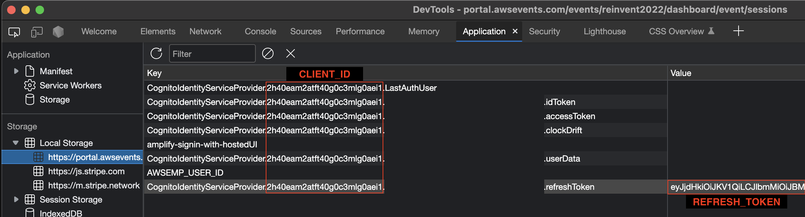

# AWS Events Session Availability Sniper

This is a cloudflare worker project that will allow you to monitor the availability of AWS Events sessions. It will send you an email when a session from your favorites list becomes available.

## Configuration

This project requires the following environment variables:

| Variable | Description |
| --- | --- |
| `CLIENT_ID` | The client id from AWS Cognito for AWS Events |
| `EVENT_ID`  | The event id of the event you want to monitor |
| `REFRESH_TOKEN` | The refresh token of your AWS Events account |
| `TO` | The email address you want to receive the notification |

The `CLIENT_ID` and `REFRESH_TOKEN` can be found in the browser's localStorage after logging in to AWS Events.

Be sure to copy the entire value for `REFRESH_TOKEN`.

The `EVENT_ID` can be found by inspecting the POST request to `https://api.us-east-1.prod.events.aws.a2z.com/attendee/graphql` when interacting with the events portal.

For re:Invent 2022, the `EVENT_ID` is `53b5de8d-7b9d-4fcc-a178-6433641075fe`.

## Setup

1. Create a Cloudflare account
2. Install the [wrangler](https://developers.cloudflare.com/workers/cli-wrangler/install-update) CLI
3. Login to your Cloudflare account with `wrangler login`
4. Clone this repository
5. Configure the environment variables using `wrangler`, e.g. `wrangler secret put REFRESH_TOKEN`, using the cloudflare web UI, or by setting the non-secret variables in `wrangler.toml`
6. Publish the code using `wrangler publish`

## Usage

The worker will run every 60 minutes and check for availability. It will download a list of your favorite sessions, then parse the sessions for a change in their actionable status (e.g. can be waitlisted or reserved). If a session becomes available, it will send an email to the address specified in the `TO` environment variable.